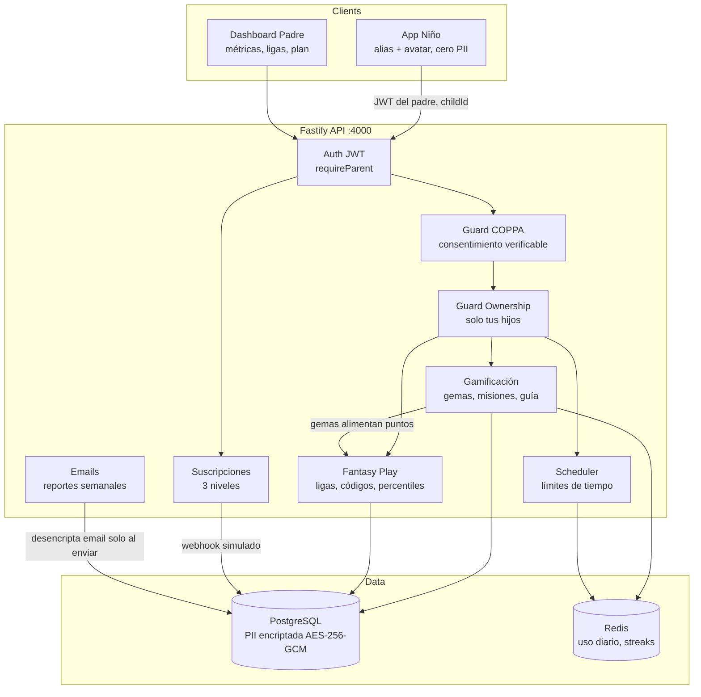

# Kiddoki 🌱

Plataforma EdTech segura para niños de 1 a 11 años. Contenido curado, gamificación, anonimidad total (COPPA/GDPR-K) y control parental por suscripción.

## Stack

| Capa | Tecnología |
|------|-----------|
| Backend | Node.js + TypeScript + Fastify 5 (rápido, tipado fuerte) |
| Frontend | Next.js 15 + React 19 + Tailwind CSS |
| Datos | PostgreSQL 16 (usuarios, suscripciones, ligas) + Redis 7 (sesiones, streaks, contadores de tiempo) |
| Pagos | Stripe (simulado en MVP, misma forma de API) |
| Emails | Resend/SendGrid (simulado en MVP, plantillas listas) |

## Arquitectura y flujo de datos seguro



### Flujo Fantasy Play (solo padres)

1. Padre A (plan Brote/Bosque) crea liga → recibe **código seguro de 8 chars** (rotable).
2. Padre B usa el código para inscribir el perfil **anónimo** de su hijo.
3. Cada misión completada suma gemas → puntos de liga automáticamente.
4. Leaderboard muestra **solo alias + avatar + puntos + percentil**. Nunca nombres reales, fotos ni datos del padre.
5. Hitos colectivos (500/1000/5000 gemas grupales) disparan emails de celebración.

### Garantías COPPA / GDPR-K

- **PII solo en tabla `parents`**, encriptada con AES-256-GCM (clave en env, rotable).
- **Niños 100% anónimos**: alias generado por el sistema ("Zorro Azul 42") + avatar determinístico por seed. Sin nombres reales, sin fotos, sin campos libres de texto.
- **Consentimiento parental verificable** obligatorio en registro; guard `requireCoppaConsent` bloquea toda función infantil sin él.
- **Ownership guard**: un padre solo accede a datos de sus propios hijos.
- Los emails se desencriptan solo en el momento del envío.

## Correr en local

```bash
# 1. Infraestructura (Postgres carga schema.sql automáticamente)
docker compose up -d

# 2. Backend
cd backend
cp .env.example .env
npm install
npm run dev        # http://localhost:4000/health

# 3. Frontend (proxy /api -> :4000 ya configurado)
cd ../frontend
npm install
npm run dev        # http://localhost:3000
```

Flujo demo: `/parent` → registrarse (consentimiento COPPA) → crear hijo → activar plan Brote (pago simulado) → crear liga → `/kid` → completar misiones → ver leaderboard y métricas en `/parent`.

## Estructura

```
backend/src/
  server.ts            # bootstrap Fastify
  plugins/auth.ts      # JWT + guards COPPA/ownership
  lib/crypto.ts        # AES-256-GCM PII + scrypt passwords
  lib/anonymizer.ts    # alias, avatar seeds, códigos de invitación
  db/schema.sql        # migración completa
  modules/
    auth.ts            # registro padres, perfiles hijos anónimos
    gamification.ts    # gemas/estrellas, misiones, evolución del guía
    parental.ts        # métricas, límites de tiempo, sesiones
    subscriptions.ts   # 3 niveles (Semilla/Brote/Bosque), Stripe simulado
    leagues.ts         # Fantasy Play: ligas, códigos, percentiles, hitos
    emails.ts          # plantillas + job de reportes semanales
frontend/app/
  kid/page.tsx         # dashboard niño (visual, táctil, gamificado)
  parent/page.tsx      # dashboard padre (métricas, plan, Fantasy Play)
```

## Hacia producción

- Sustituir `SimulatedStripe` por SDK `stripe` + webhook firmado.
- Sustituir sender de emails por Resend (`fetch` a su API) + cron real para `runWeeklyReports`.
- Token JWT a cookie httpOnly + refresh tokens.
- Rate limiting (`@fastify/rate-limit`) y helmet.
- Verificación de consentimiento COPPA robusta (micro-cargo a tarjeta o ID).
